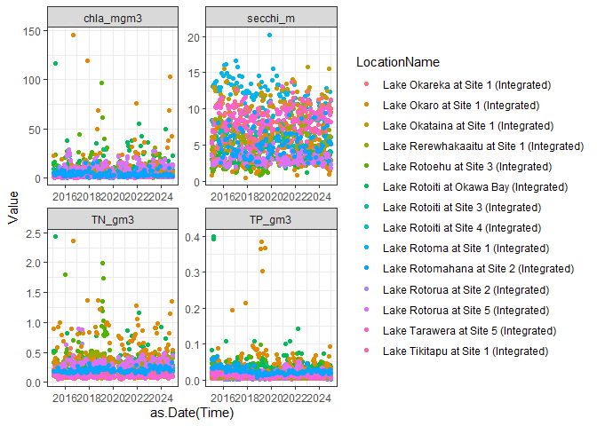
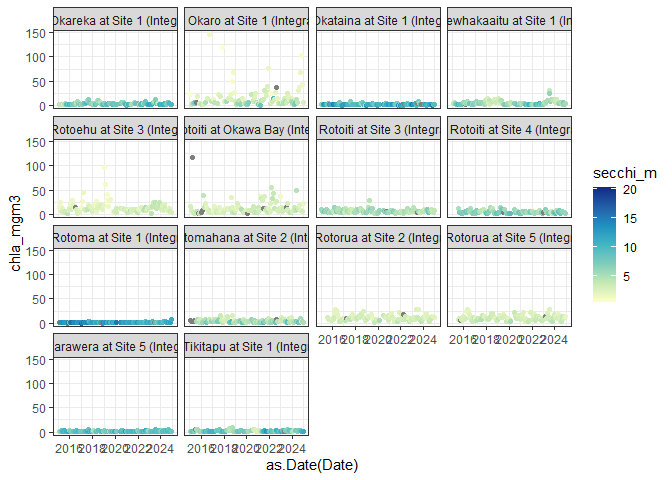
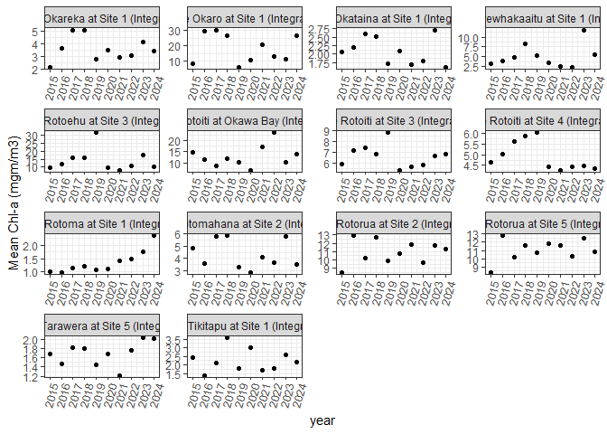
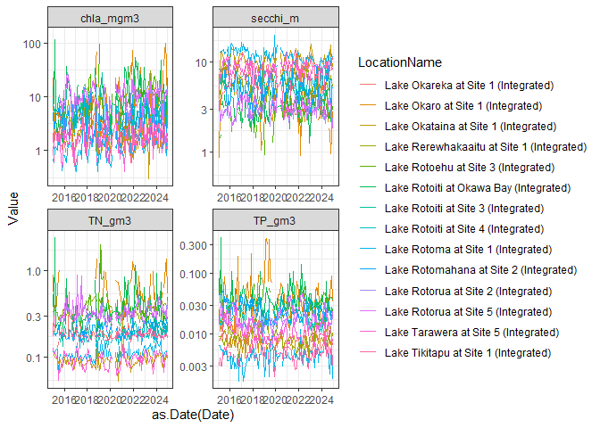
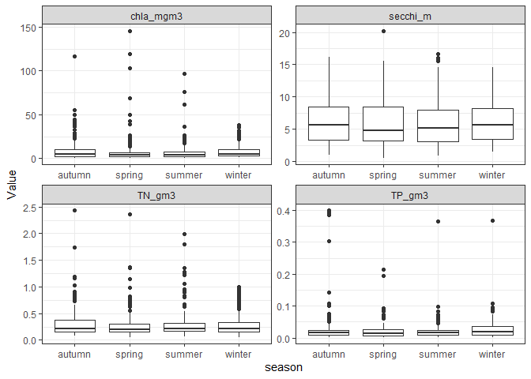

BOPRC R Tutorial 3 - Manipulating and plotting time series data: Part 1
================

## Overview

This lesson is designed to provide you with experience in manipulating
and plotting time series data.

The main packages that we will use in this tutorial are:

- **tidyverse**

Before attempting to install these packages, make sure your Primary CRAN
Repository is set to:

- **“New Zealand \[https\] - University of Auckland”**

To check this, click ‘Tools’ –\> ‘Global Options’ –\> ‘Packages’. Click
‘Change’ if you need to adjust this.

You can download most packages by clicking on the ‘Install’ button on
the ‘packages’ tab in the lower right window pane. Then in the Install
Packages popup, select ‘Repository (CRAN)’ from the ‘Install from’ drop
box and type the name of the package you wish to download (e.g., dplyr).

Once all of these packages are installed you can load them using the
‘library’ function:

``` r
library(tidyverse)
library(lubridate)
```

First we will load in our data

``` r
wq <- read.csv('./data/Lake_WQ_Timeseries.csv')
```

Now, open the `wq` dataframe by clicking on it in the environment and
familiarise yourself with the columns. Let’s select just a few which we
want to work with, using the `select` function

``` r
wq <- wq %>% 
  select(LocationName:Value, Parameter, Unit) # list the columns you want to keep, you can use, e.g. col1:col3 to select a range of columns
```

What are the lakes which are included in this data?

``` r
unique(wq$LocationName)
```

    ##  [1] "Lake Rotoma at Site 1 (Integrated)"       
    ##  [2] "Lake Rotoehu at Site 3 (Integrated)"      
    ##  [3] "Lake Rotoiti at Site 4 (Integrated)"      
    ##  [4] "Lake Rotoiti at Site 3 (Integrated)"      
    ##  [5] "Lake Rotoiti at Okawa Bay (Integrated)"   
    ##  [6] "Lake Rotorua at Site 2 (Integrated)"      
    ##  [7] "Lake Okataina at Site 1 (Integrated)"     
    ##  [8] "Lake Okareka at Site 1 (Integrated)"      
    ##  [9] "Lake Tikitapu at Site 1 (Integrated)"     
    ## [10] "Lake Rerewhakaaitu at Site 1 (Integrated)"
    ## [11] "Lake Okaro at Site 1 (Integrated)"        
    ## [12] "Lake Rotorua at Site 5 (Integrated)"      
    ## [13] "Lake Tarawera at Site 5 (Integrated)"     
    ## [14] "Lake Rotomahana at Site 2 (Integrated)"

------------------------------------------------------------------------

***Challenge 1:*** *Using the same `unique()` function, what variables
are included in this dataset, in the `Parameter` column?*

<details>
<summary>
Click to see a solution
</summary>

``` r
unique(wq$Parameter)
```

    ## [1] "TN (g/m^3)"    "TP (g/m^3)"    "CHLA (mg/m^3)" "VC - SD (m)"

``` r
# This shows we have total nitrogen, total phosphorus, chlorophyll-a, and
# Secchi depth
```

</details>

------------------------------------------------------------------------

The names of the parameters have spaces and symbols in them which can be
annoying to work with in R. Let’s clean that up. We will use a function
called `recode` which can be used to change the name of a value in a
column. Here, we are saying take the `wq` dataframe, and mutate the
column `Parameter` such that the values of `Parameter` which currently
equal “TN (g/m^3)”, will be rewritten as “TN_gm3”.

``` r
wq <- wq %>%
    mutate(Parameter = recode(Parameter, `TN (g/m^3)` = "TN_gm3"), Parameter = recode(Parameter,
        `TP (g/m^3)` = "TP_gm3"))
```

------------------------------------------------------------------------

***Challenge 2:*** *We have done this for TN and TP. Now try using the
same method to recode chlorophyll-a and Secchi depth.*

<details>
<summary>
Click to see a solution
</summary>

``` r
wq <- wq %>%
    mutate(Parameter = recode(Parameter, `CHLA (mg/m^3)` = "chla_mgm3"), Parameter = recode(Parameter,
        `VC - SD (m)` = "secchi_m"))
```

</details>

------------------------------------------------------------------------

Now let’s make a plot of our data, using the `facet_wrap` function to
display the different parameters

``` r
ggplot(wq, aes(x = as.Date(Time), y = Value, color = LocationName)) + geom_point() +
    facet_wrap(~Parameter, scales = "free") + theme_bw()
```

<!-- -->

``` r
# the scales = 'free' in the facet_wrap() function allows the x and y-axes to
# vary by each panel
```

### the `pivot_wider` function

Let’s say we’re interested in a plot of chl-a, but we want to color it
based on the Secchi depth in that lake. Our dataset is in long format,
so in order to do this, we need to make it into wide format (e.g.,
instead of Parameters as a column, TN, TP, chla, and Secchi will be
their own columns, with the vaues in that column)

``` r
wq_wide <- wq %>%
    pivot_wider(names_from = "Parameter", values_from = "Value")
```

    ## Warning: Values from `Value` are not uniquely identified; output will contain list-cols.
    ## • Use `values_fn = list` to suppress this warning.
    ## • Use `values_fn = {summary_fun}` to summarise duplicates.
    ## • Use the following dplyr code to identify duplicates.
    ##   {data} |>
    ##   dplyr::summarise(n = dplyr::n(), .by = c(LocationName, Time, Unit,
    ##   Parameter)) |>
    ##   dplyr::filter(n > 1L)

That threw some warnings, so let’s look at the dataframe and see if
everything looks ok. When we open up `wq_wide`, we see there are a lot
of “NULL” values for the different columns. That is because our `Time`
column is very specific, and includes not just dates but times, which
aren’t really important in this case. We also have the `Unit` column,
which is not the same across parameters and is causing an issue. Let’s
create a `Date` column, remove `Time` and `Unit`, and try making the
dataframe wide again

``` r
wq_wide <- wq %>%
    mutate(Date = as.Date(Time)) %>%
    select(-Time, -Unit) %>%
    pivot_wider(names_from = "Parameter", values_from = "Value")
```

    ## Warning: Values from `Value` are not uniquely identified; output will contain list-cols.
    ## • Use `values_fn = list` to suppress this warning.
    ## • Use `values_fn = {summary_fun}` to summarise duplicates.
    ## • Use the following dplyr code to identify duplicates.
    ##   {data} |>
    ##   dplyr::summarise(n = dplyr::n(), .by = c(LocationName, Date, Parameter)) |>
    ##   dplyr::filter(n > 1L)

Hmm, that still throws a warning. If we look at `wq_wide` again, we see
that there are some columns, which have two values in them (e.g., Lake
Rotoma on 2015-01-20 has two entries for TP). To fix this, let’s take
the average on a given day for a given lake if there is more than one
reading. We will need to introduce a couple of new functions to
accomplish this.

### The `group_by` and `summarise` functions

`group_by` is a `tidyverse` function which allows you to do calculations
by different groups (e.g., the LocationName column). It is usually
paired with another function which does the calculation. For example,
`summarise` is a `tidyverse` function which, as it sounds, summarises by
a given function, typically taking the mean, minimum, or some other
summary statistic. This function results in a short dataframe, because
you’ve summarised the values. We will pair `group_by` with `summarise`
to create summary statistics for each lake.

``` r
wq_wide <- wq %>% 
  mutate(Date = as.Date(Time)) %>% # keeping these lines in our workflow to remove Time and Unit
  select(-Time, -Unit) %>% 
  group_by(LocationName, Date, Parameter) %>% 
  summarise(Value = mean(Value, na.rm = TRUE)) %>% 
  pivot_wider(names_from = 'Parameter', values_from = 'Value') # then we pivot wider
```

Viola! No warnings and our dataframe looks good!! Ok, now let’s make a
plot of chl-a over time, but colored in by Secchi (our original goal
before all that data manipulation…)

``` r
ggplot(wq_wide, aes(x = as.Date(Date), y = chla_mgm3, color = secchi_m)) + geom_point() +
    facet_wrap(~LocationName) + scale_color_distiller(palette = "YlGnBu", direction = 2) +
    theme_bw()
```

    ## Warning: Removed 142 rows containing missing values or values outside the scale range
    ## (`geom_point()`).

<!-- -->

``` r
# scale_color_distiller changes the color scheme, you can google
# scale_color_distiller to find out other palettes you can use, direction = 2
# just changes whether the scales goes from blue to yellow with blue as high or
# low, in this case, we want blue to be high. try changing direction = 1 and
# see what happens
```

------------------------------------------------------------------------

***Challenge 3a:*** *Now that we’ve used `pivot_wider`, try to use
pivot_longer to turn your dataframe back into longer format*

<details>
<summary>
Click to see a solution
</summary>

``` r
wq_long <- wq_wide %>%
    pivot_longer(TN_gm3:secchi_m, names_to = "Parameter", values_to = "Value")

# being able to pivot between wide and long format is really helpful for
# different types of analyses and plotting!
```

</details>

------------------------------------------------------------------------

------------------------------------------------------------------------

***Challenge 3b:*** *Now that you’ve made your wq_long dataframe, try
making a plot with Date on the x-axis, Value on the y-axis, color by
Parameter, and facet_wrap by LocationName*

<details>
<summary>
Click to see a solution
</summary>

``` r
ggplot(wq_long, aes(x = as.Date(Date), y = Value, color = LocationName)) + geom_line() +
    facet_wrap(~Parameter, scales = "free") + theme_bw()
```

</details>

------------------------------------------------------------------------

### Calculating annual means

We’ve now plotted the full time series but we want to get a more
summarised overview of the water quality across the lakes, so we will
calculate some summary statistics. Let’s calculate the annual means for
each variable and lake. First we need to create a new column which
represents the year. We will use the function `year` in the `lubridate`
package

``` r
wq_summary <- wq %>%
    mutate(year = year(Time)) %>%
    group_by(LocationName, Parameter, year) %>%
    summarise(mean = mean(Value, na.rm = TRUE), min = min(Value, na.rm = TRUE), max = max(Value,
        na.rm = TRUE), sd = sd(Value, na.rm = TRUE))
```

View the wq_summary dataframe and familiarise yourself with it. Let’s
plot the chl-a data to visualize it a bit more clearly.

``` r
wq_summary %>% 
  filter(Parameter=='chla_mgm3') %>% # only plot TN
  ggplot(aes(x = year, y = mean)) +
  geom_point() +
  scale_x_continuous(breaks = seq(min(wq_summary$year), max(wq_summary$year), by = 1)) + # formats the years on the x-axis
  facet_wrap(~LocationName, scales = 'free') +
  theme_bw() +
  theme(axis.text.x = element_text(angle = 75, hjust = 1))  +
  ylab('Mean Chl-a (mgm/m3)')
```

<!-- -->

------------------------------------------------------------------------

***Challenge 4:*** *That’s a lot of lakes to wrap your head around.
Let’s create a plot for just Lake Rotorua at Site 2, and facet by
Parameter*

<details>
<summary>
Click to see a solution
</summary>

``` r
wq_summary %>% 
  filter(LocationName=="Lake Rotorua at Site 2 (Integrated)") %>% # only plot TN
  ggplot(aes(x = year, y = mean)) +
  geom_point() +
  scale_x_continuous(breaks = seq(min(wq_summary$year), max(wq_summary$year), by = 1)) + #formats the years on the x-axis
  facet_wrap(~Parameter, scales = 'free') +
  theme_bw() +
  theme(axis.text.x = element_text(angle = 75, hjust = 1)) # this rotates the x-axis label since the LocationNames are long
```

<!-- -->
</details>

------------------------------------------------------------------------

We could add the standard deviation as error bars using `geom_errorbar`
or could plot the min or max instead of the mean. So many options!

However, we know there is strong seasonal variability. Let’s look at
seasonal means instead of overall

### The `mutate` and `ifelse` functions

The `mutate` function creates an entirely new column in our dataframe.
This works similarly to `summarise` which we used above, except instead
of summarising into a smaller dataframe, we use `mutate` across all our
data and maintain the same number of rows. In order to do seasonal
means, we need to first create a season identifier. We will pair
`mutate` with `ifelse` which is a function that allows you to perform a
conditional operation which says if(this condition), then do X, if not,
do Y. Here, we are saying if the month of our time column is 12, 1, 2,
make the new column ‘season’ = ‘summer’, if not set it to NA. We repeat
this for each season.

``` r
# go back to our original wq dataframe, not the summarised one and add a new
# column: season
wq <- wq %>%
    mutate(season = ifelse(month(Time) %in% c(12, 1, 2), "summer", NA), season = ifelse(month(Time) %in%
        c(3, 4, 5), "autumn", season), season = ifelse(month(Time) %in% c(6, 7, 8),
        "winter", season), season = ifelse(month(Time) %in% c(9, 10, 11), "spring",
        season))
# this function says create a new column `season` and then we use the ifelse
# function to do this for each season based on the month
```

Let’s plot the range of values across each season

``` r
ggplot(wq, aes(x = season, y = Value)) + geom_boxplot() + facet_wrap(~Parameter,
    scales = "free") + theme_bw()
```

<!-- -->

***Challenge 5:*** *It’s nice to see the boxplots, but we want the
actual numbers for median, min, max, etc.. Calculate summary statistics
for each lake, season, and parameter. HINT: We will bring back our
friends `group_by` and `summarise` for this.*

<details>
<summary>
Click to see a solution
</summary>

``` r
wq <- wq %>%
    group_by(LocationName, season, Parameter) %>%
    summarise(mean = mean(Value, na.rm = TRUE), median = median(Value, na.rm = TRUE),
        min = min(Value, na.rm = TRUE), max = max(Value, na.rm = TRUE), sd = sd(Value,
            na.rm = TRUE))

# Open up your dataframe and see if all looks good. There should be one value
# for each season, lake, and parameter
```

</details>

------------------------------------------------------------------------

### BONUS: plotting annual means again NPSFM bands
